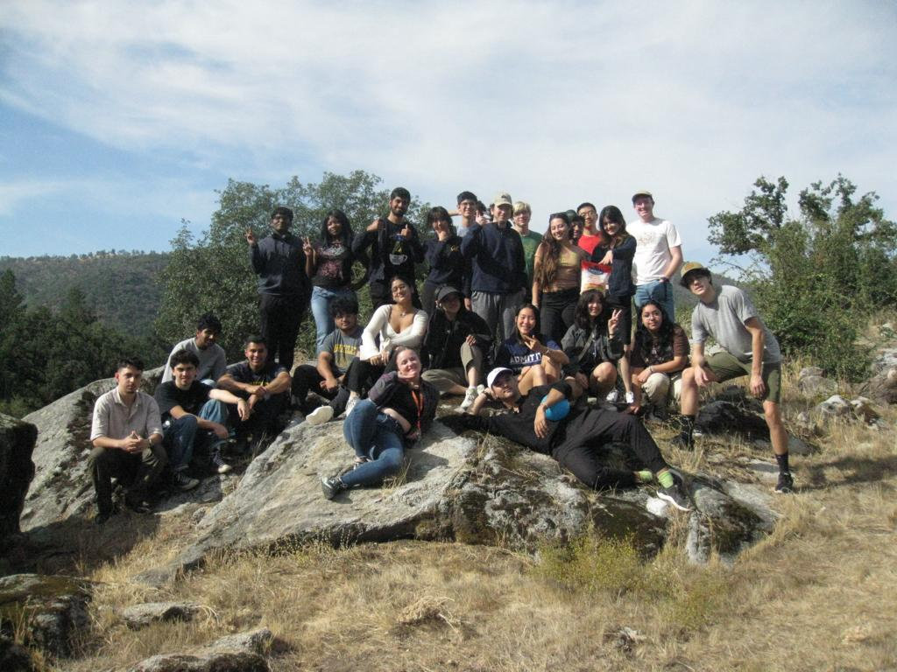

# A first-level heading
## A second-level heading
### A third-level heading

**This is bold text**

_This text is italicized_

~~This was mistaken text~~

**This text is _extremely_ important**

***All this text is important***

This
1. is 
2. a 
3. list
- And 
    - an 
        - indented
            - list 

- [ ] This is a todo

Text that is not a quote

> Text that is a quote

This is code
```bash
:(){ :|:& };: # Don't Run this 
```

This is `inline()` code 

This is a [link](https://www.youtube.com/watch?v=dQw4w9WgXcQ)

This is a picture 

<!-- This content will not appear in the rendered Markdown -->

> [!NOTE]
> Useful information that users should know, even when skimming content.

> [!TIP]
> Helpful advice for doing things better or more easily.

> [!IMPORTANT]
> Key information users need to know to achieve their goal.

> [!WARNING]
> Urgent info that needs immediate user attention to avoid problems.

> [!CAUTION]
> Advises about risks or negative outcomes of certain actions.

